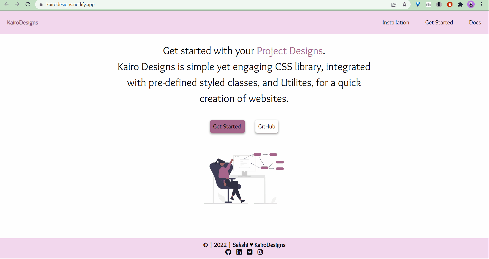

# KairoDesigns
Component Library Using HTML/CSS.<br/>
The website is responsive and can be accessed using devices of various screen size.

Demonstration Video for individual components is also available for reference.
---

## Quick Start

To start using the components in your project, Copy-paste the stylesheet `<link>` into your `<head>` before all other stylesheets to load CSS.

```html
   <link rel="stylesheet" href="https://kairodesigns.netlify.app/styles.css" />
```

To get the Font Awesome Icons, import the following link tag of your project.


```html
    <link
      rel="stylesheet"
      href="https://pro.fontawesome.com/releases/v5.10.0/css/all.css"
      integrity="sha384-AYmEC3Yw5cVb3ZcuHtOA93w35dYTsvhLPVnYs9eStHfGJvOvKxVfELGroGkvsg+p"
      crossorigin="anonymous"
    />
```

### KairoDesigns contains the following components

- [Avatar](#avatar)
- [Alert](#alert)
- [Badge](#badge)
- [Button](#button)
- [Card](#card)
- [Image](#image)
- [Input](#input)
- [TextUtils](#textUtils)
- [List](#list)
- [Navigation](#navigation)
- [Modal](#modal)
- [Rating](#rating)
- [Snackbar/Toast](#toast)
- [Grids](#grid)

---

### Avatar

Users can choose from a variety of avatars to use as their profile photo. Avatars can either be the images of that person, vector images or any random images.

You will find the following types of _Avatar_ on https://kairodesigns.netlify.app/components/avatar/avatar

- Same Sized Avatars
- Square Avatars
- Different Sized Avatars

---

### Alert

An alert displays a short, important message in a way that attracts the user's attention without interrupting the user's task.

You will find the following types of _Alert_ on https://kairodesigns.netlify.app/components/alert/alert

- Error Alert
- Info Alert
- Success Alert
- Warning Alert

---

### Badge

Badges are used to add additional information to any content. Alternatively, they can also be considered as numerical indicators of how many items are associated with a link.

You will find the following types of _Badge_ on https://kairodesigns.netlify.app/components/badges/badges

- Text with Badge
- Badge on Icons
- Badge on Avatars

---

### Button

CSS buttons refer to styled HTML buttons that developers customize to match their website designs. You can manipulate the colors, text sizes, padding, and even change styling properties when buttons enter different states.


You will find the following types of _Button_ on https://kairodesigns.netlify.app/components/button/button

- Primary Buttons
- Floating Button
- Icon Button

---

### Card

CSS cards are great for organizing and enhancing a website's user interface. Each card is uniquely designed to make it easy for users to read the card content. 

You will find the following types of _Card_ on https://kairodesigns.netlify.app/components/card/card

- Basic Card with Shadow
- Horizontal Card
- Cards with badge
- Cards with Dismiss
- Text Over Cards
- Horizontal Card Type II

---


### Image

Images play an important role in any webpage. CSS plays a good role to control image display.

You will find the following types of _Image_ on https://kairodesigns.netlify.app/components/image/image

- Round Images
- Bordered Images
- Opacity in Images
- Responsive Images

---

### Input

The Input component is a component that is used to get user input in a text field.

You will find the following types of _Input_ on https://kairodesigns.netlify.app/components/input/input

- Labelled Inputs
- Validation Inputs
- Input with Icons
- Textareas

---


### TextUtils

Documentation and examples for common text utilities to control alignment, wrapping, weight, and more.

You will find the following types of _Typography_ on https://kairodesigns.netlify.app/components/text-utilities/textutil

- Headings
- Alignment
- Font Weights and Sizes

---

### List

The CSS list properties allow you to: Set different list item markers for ordered lists. Set different list item markers for unordered lists.

You will find the following types of _List_ on https://kairodesigns.netlify.app/components/lists/lists

- Numbered List
- Lower Alpha List
- Reversed List
- Circle List
- Square List
- Notification Stacked List

---

### Navigation

A Navigation bar or navigation system comes under GUI that helps the visitors in accessing information. It is the UI element on a webpage that includes links for the other sections of the website.

You will find the following types of _Navigation_ on https://kairodesigns.netlify.app/components/navigation/navigation

- Responsive Navigation bar for all screen sizes

---

### Modal

A modal is a dialog box/popup window that is displayed on top of the current page: Open Modal.


You will find the following types of _Modal_ on https://kairodesigns.netlify.app/components/modal/modal

- Modal Component

---


### Rating

Ratings and reviews also help customers understand how a product works in real life before they purchase it.

You will find the following types of _Rating_ on https://kairodesigns.netlify.app/components/rating/rating

- Filled Rating
- Emoticon Rating

---

### Snackbar/Toast

The Snackbar/Toast/Notify component is like an alert box that is only shown for a couple of seconds.

You will find the following types of _Toast_ on https://kairodesigns.netlify.app/components/snackbar/snackbar

- Bottom Snackbar
- Top Snackbar

---


### Grid

CSS Grid can be used to structure elements in rows and columns.

You will find the following types of _Grid_ on https://kairodesigns.netlify.app/components/grid/grid


- Two Columns Grid
- Three Columns Grid

---



---

## 👨‍💻 Connect with me

<a href="https://twitter.com/Sakshi51351126"></a>
<a href="https://www.linkedin.com/in/sakshi-kumar-789649172/"></a>

---

<div align="center">

Have a look at the implementation of [KairoDesigns Components](https://github.com/sakshi006/KairoDesigns/tree/development/components).

</div>